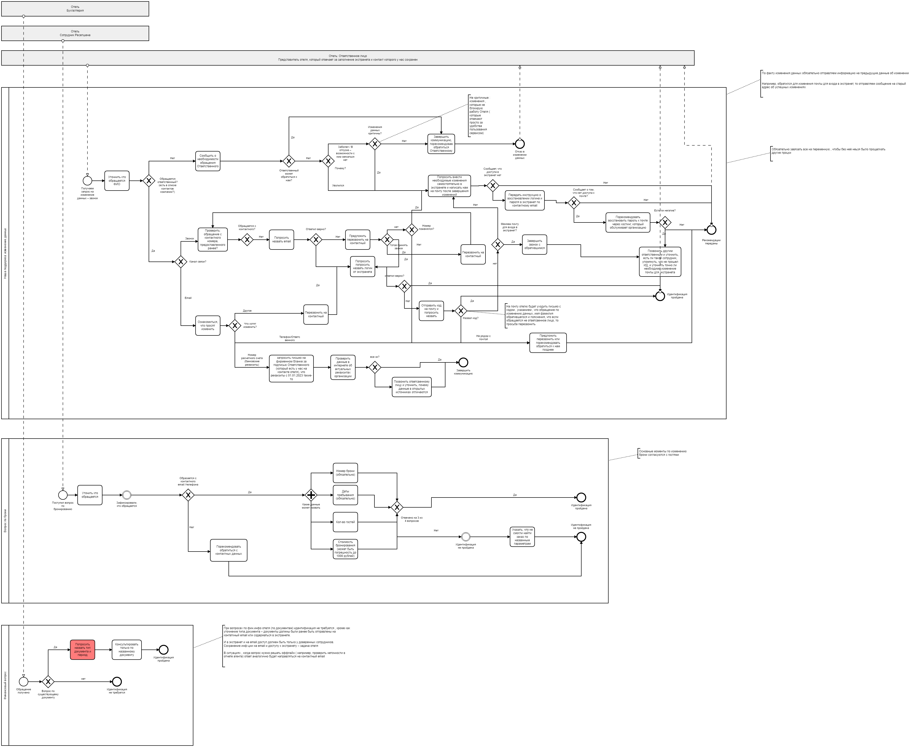

# B2B HOTELS: Построение процесса «Идентификация»

## 📌 Описание проекта
В рамках проекта я разработала полноценный процесс идентификации клиентов для внутренней операционной команды. Работа включала анализ текущей ситуации, выделение основных потоков, построение схем в BPMN, согласование с SME и оформление итоговой процедуры.

Проект был направлен на повышение точности идентификации, сокращение количества ошибок и ускорение обработки клиентских запросов.

---

## 🚀 Основные этапы проекта

### **1. Анализ текущей ситуации**
- Ознакомилась с типовыми сценариями и вопросами сотрудников.  
- Изучила существующие регламенты идентификации для *Lifestyle* и *SME*.  
- Проверила текущие возможности инструментов и ограничения процесса.  

**Результат:** сформировала полное понимание текущей логики, разрывов и точек улучшения.

---

### **2. Выделение основных рабочих потоков (стримов)**
Определила три ключевых направления обработки запросов:

1. **Изменение данных клиентов**  
2. **Финансовые вопросы**  
3. **Действия и консультации по конкретным бронированиям**

**Результат:** структура будущего процесса стала прозрачной и удобной для построения BPMN.

---

### **3. Построение схем работы (BPMN 2.0)**
Создала детализированные диаграммы BPMN, включающие:

- последовательность шагов,
- ответственных участников,
- правила идентификации,
- условия переходов и решения по исключительным ситуациям.

**Результат:** готовая наглядная логика для внедрения и автоматизации.

---

### **4. Согласование процесса**
Провела согласование с:

- SME (subject matter experts),
- операционной командой,
- смежными отделами.

В процессе уточнены роли, улучшена последовательность действий и унифицированы правила идентификации.

---

### **5. Разработка итоговой процедуры**
Подготовила финальный документ, включающий:

- пошаговую инструкцию для сотрудников,
- бизнес-правила идентификации,
- порядок действий для каждого стрима,
- обработку исключений,
- требования к документам.

Процедура передана команде для внедрения.

---

## 🛠 Использованные навыки и инструменты

### **Hard Skills**
- Анализ бизнес-процессов  
- BPMN 2.0  
- Работа с REST API (анализ методов и возможностей интеграции)  
- Документирование и разработка регламентов  
- Сбор и уточнение требований  

### **Soft Skills**
- Коммуникация со стейкхолдерами  
- Структурное мышление  
- Решение неоднозначных задач  
- Управление ожиданиями и согласование  
- Навык презентации информации  

---

## 📎 Визуальные материалы
*(Здесь можно вставить изображения созданных схем или презентацию этапов проекта — например, график с шагами процесса.)*

---

## ✔️ Результаты проекта
- Создан согласованный, прозрачный и повторяемый процесс идентификации.  
- Снижено количество ошибок, связанных с некорректной идентификацией.  
- Оптимизировано время обработки клиентских запросов.  
- Процесс стал готовым для масштабирования и возможной автоматизации.

---

## 📄 Дополнительно
Если интересно, я могу подготовить:
- диаграммы в **BPMN**,
- оформленный **PDF**,
- англоязычную версию README,
- красивую инфографику для размещения на GitHub.

_____________________________________________________________________________________________________________________________________________________________________________________________________________________________________________

# B2B HOTELS: Customer Identification Process

## 📌 Project Overview
This project focused on designing a complete customer identification process for an internal operations team. The work included analyzing existing workflows, identifying key request streams, building BPMN 2.0 diagrams, aligning the process with SMEs, and creating the final operational procedure.

The goal was to increase accuracy, reduce errors, and standardize the way identification-related requests are handled.

---

## 🚀 Project Stages

### **1. Initial Analysis**
- Reviewed typical employee and customer scenarios.  
- Studied the existing identification rules for *Lifestyle* and *SME*.  
- Assessed current tools, limitations, and operational capabilities.  

**Outcome:** a clear understanding of gaps, inconsistencies, and improvement opportunities.

---

### **2. Identification of Key Streams**
Three main request streams were defined:

1. **Customer data changes**  
2. **Financial questions**  
3. **Actions and consultations related to specific bookings**

**Outcome:** the structure for further BPMN modeling became clear and well-organized.

---

### **3. BPMN 2.0 Workflow Modeling**
Created detailed BPMN diagrams describing:

- step-by-step workflow logic,  
- responsible roles,  
- identification rules and decision points,  
- exceptions and alternative flows.  

**Outcome:** visual, standardized workflows ready for implementation and future automation.

---

### **4. Process Alignment**
Aligned the new process with:

- SME (subject matter experts),  
- the operations team,  
- related business units.  

Improvements were made to ensure clarity, accuracy, and unified workflow rules.

---

### **5. Final Procedure Development**
Prepared the final operational procedure that included:

- step-by-step employee instructions,  
- business rules for customer identification,  
- workflow details for each stream,  
- exception handling rules,  
- documentation requirements.

The final version was handed off for implementation.

---

## 🛠 Skills & Tools Used

### **Hard Skills**
- Business process analysis  
- BPMN 2.0 modeling  
- REST API (review and analysis of available endpoints)  
- Technical documentation  
- Requirements gathering and clarification  

### **Soft Skills**
- Cross-team communication  
- Structured problem-solving  
- Handling ambiguous situations  
- Stakeholder alignment  
- Presenting workflows and solutions  

---

